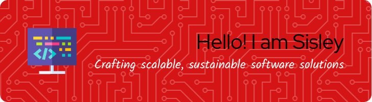
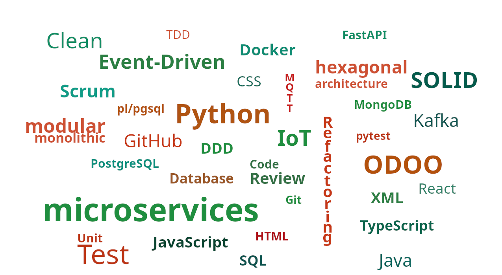

## Welcome 👋



Committed to creating innovative and scalable solutions in harmonious environments that truly contribute to society, understanding that to add value it is necessary to focus on continuous learning and adaptation to new technologies.
### Who am I?
```python
class WhoAmI:
    user = 'Sisley Jiménez'
    education = "Informatics Sciences University"
    hobbies = [
        'Playing sports',
        'Watching movie',
        'Handing out with friends',
        'Travelling'
    ]

    @staticmethod
    def get_desired_country():
        return 'Spain'

    @staticmethod
    def ambitions():
        return [
            'LearnDataScience',       # Deepen expertise in data science and analytics
            'MasterMachineLearning',  # Master ML frameworks and advanced algorithms
            'ImproveEnglish',         # Improve fluency and technical English communication
            'LeadDevTeam',            # Lead development teams and strategic projects
            'ContributeOpenSource',   # Collaborate on renowned open-source projects
            'ObtainCloudCert',        # Obtain a certification in cloud platforms (AWS/Azure/GCP)
            'MentorJuniorDev',        # Mentor and upskill less experienced peers
            'PresentAtConference',    # Present at industry conferences or meetups
            'BuildPortfolioProjects', # Build personal projects that showcase new skills
            'PublishTechArticles'     # Publish technical articles or whitepapers
        ]

```

### ❓ Some Things I Can Help You With

    🏛️ Design and implement scalable architectures in microservices and monolithic environments, following best practices for modularity and design patterns.

    🛰️ Implement IoT solutions and real-time data handling, from ingestion (MQTT, Kafka) to storage and analytics in time-series databases.

    🚀 Guide development teams and coordinate agile methodologies (Scrum) to deliver continuous value and foster collaboration.

    🎓 Provide internal mentorship and training, elevating team skills through code reviews, pair programming, and workshop sessions.

##
<div align="center">
💬 Like to meet me? Ask me about

</div>

<!-- ### Hey,[Haany here!](https://www.youtube.com/channel/UCietjxpksncMdOUkycv5nqA) -->

<!--
**SisleyInTech/SisleyInTech** is a ✨ _special_ ✨ repository because its `README.md` (this file) appears on your GitHub profile.

Here are some ideas:

- 🔭 I’m currently working on ...
- 🌱 I’m currently learning ...
- 👯 I’m looking to collaborate on ...
- 🤔 I’m looking for help with ...
- 💬 Ask me about ...
- 📫 How to reach me: ...
- 😄 Pronouns: ...
- ⚡ Fun fact: ...
- My latest posts


Crea una imagen estas cambiando palabras, deja el fondo blanco y que las letras sean las que tomen los colores, verde carmelita y otros que combinen con estos, no repitas palabras, recuerda son estas las que quiero incluir en la imagen:
Event-Driven, Python, Database, Software, microservices, modular monolithic, hexagonal architecture, Java, XML, HTML, Javascript, TypeScript, React, SOLID, Clean, IoT, ODOO, CSS, DDD, TDD, Code Review, FastAPI, MQTT, Kafka, MongoDB, PostgreSQL, Refactoring, Unit Test, SQL, pl/pgsql, Docker, Git, GitHub, Scrum
-->
